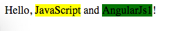

AngularJS1 Directive Transclude Demo
====================================

Use directive's `transclude` with named slots to handle multiple elements.

```
npm install
open index.html
```



Resources
---------

- AngularJS1: <https://angularjs.org/>
- transclude api and sample: <https://docs.angularjs.org/api/ng/directive/ngTransclude>
- $element api: <https://docs.angularjs.org/api/ng/function/angular.element#angularjs-s-jqlite>